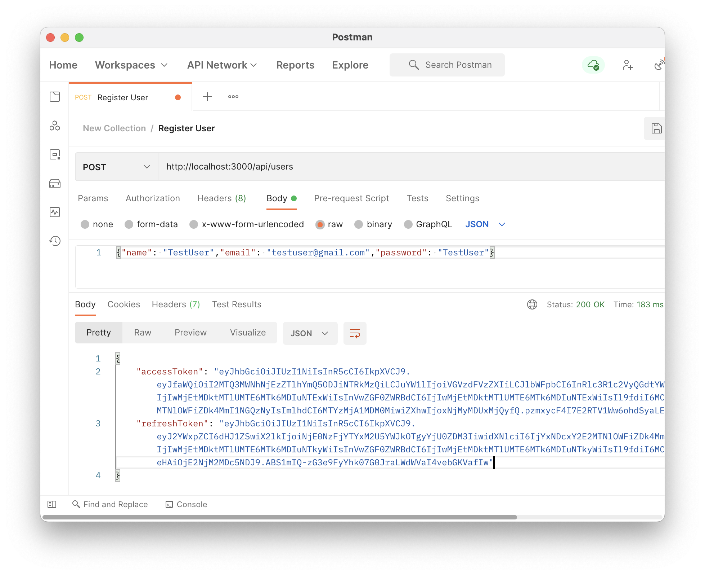
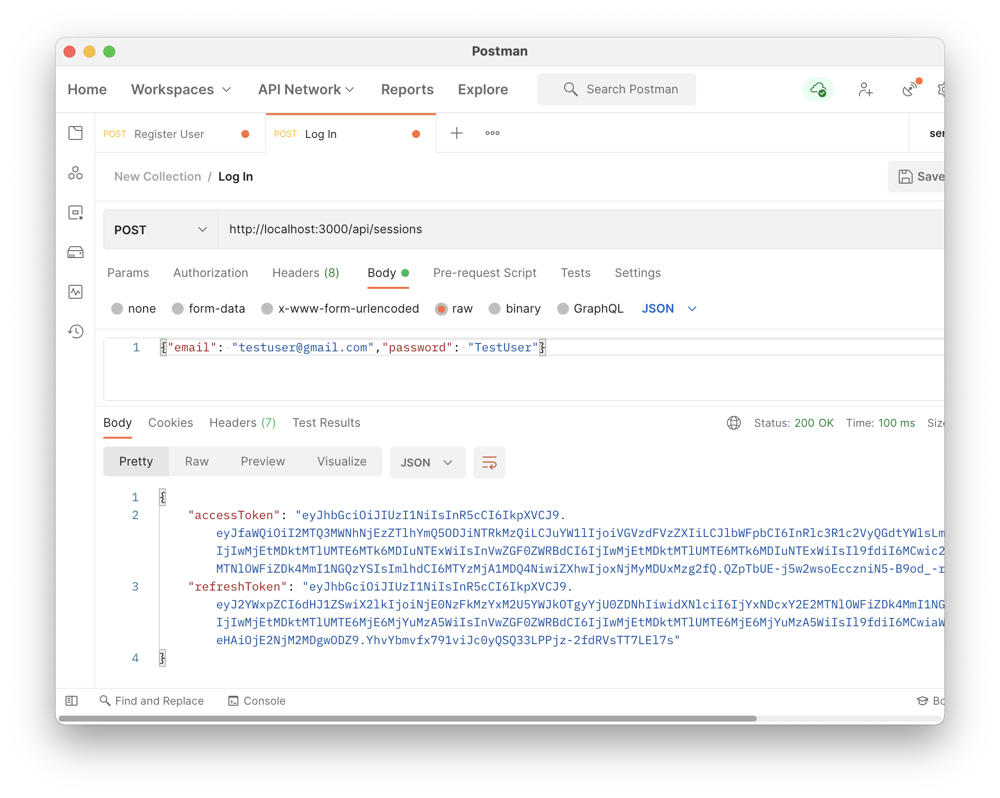
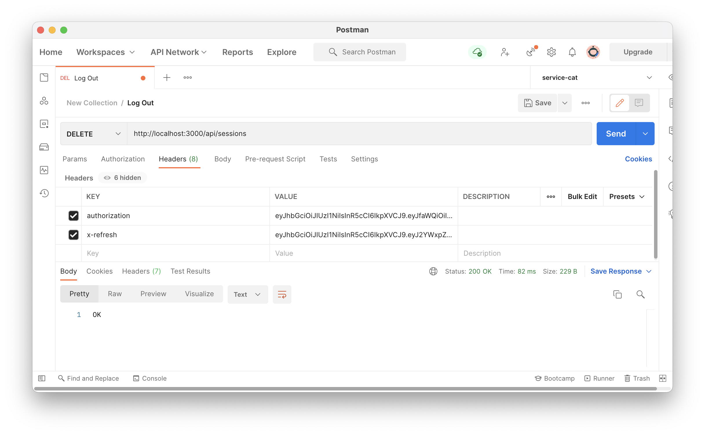
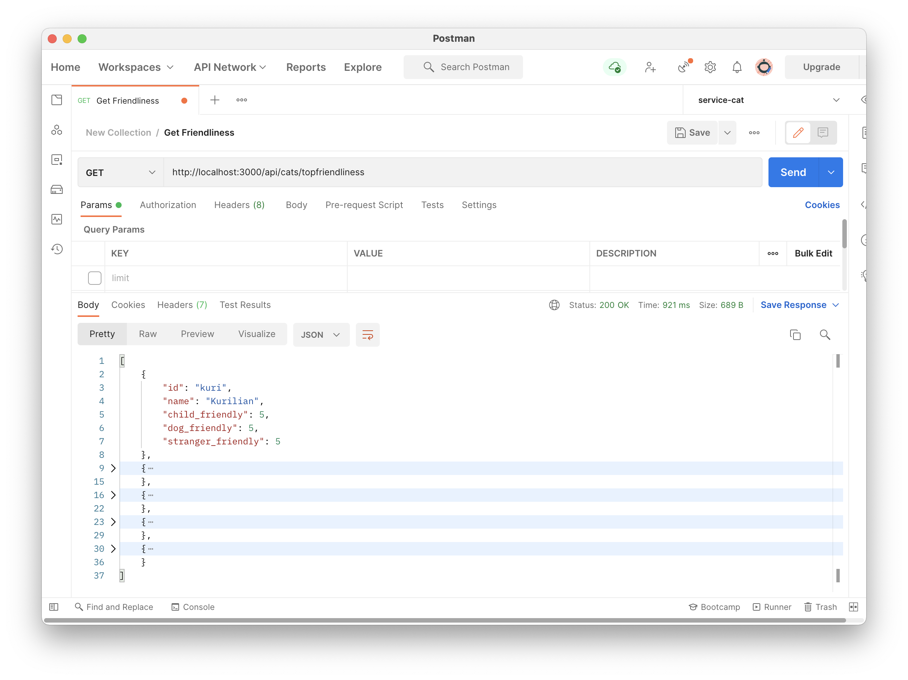
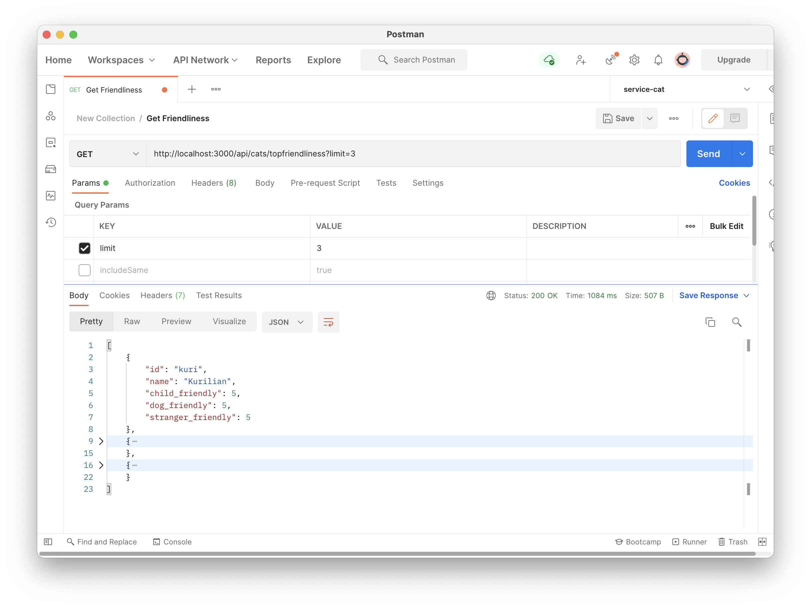
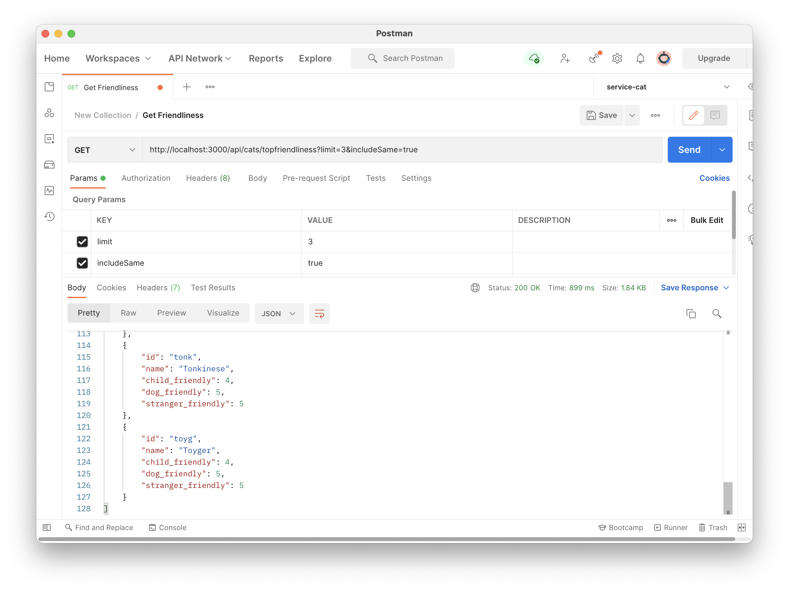
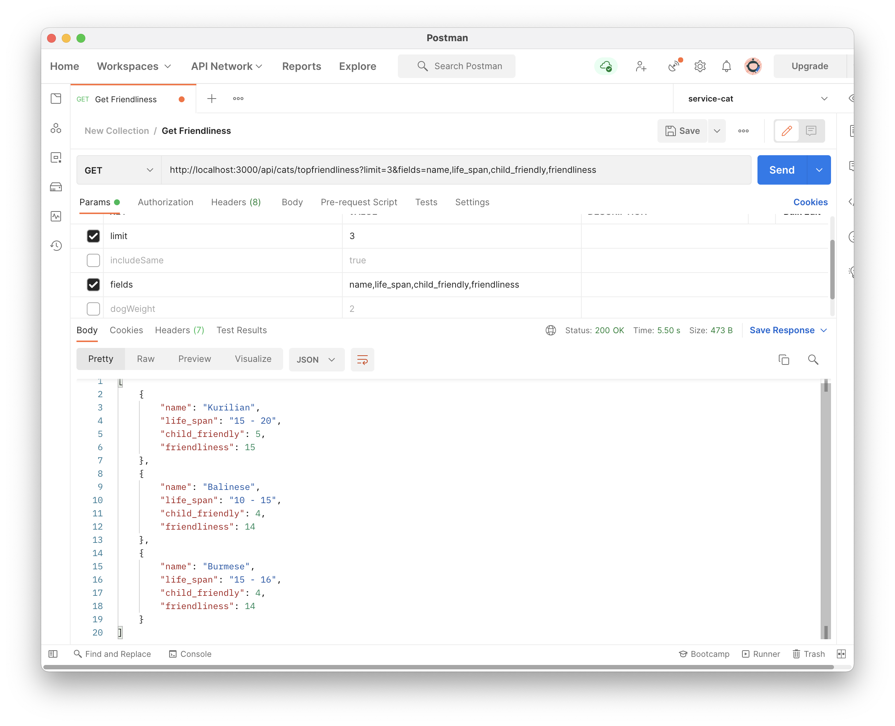
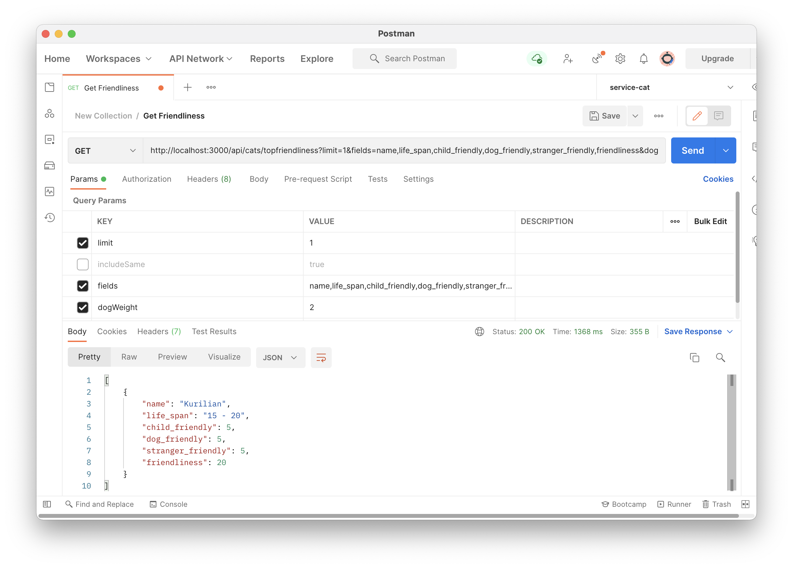

# 1. Build and Run the Code

**_Service Cat_** was developed using [Express.js](https://expressjs.com/) for providing RESTful APIs with robust routing and error handling.

## 1.1 Install Dependencies & Configure MongoDB

### 1.1.1 Install Dependencies

```
npm install
```

### 1.1.2 Install & Configure MongoDB

- Install MongoDB on your local machine
- Start MongoDB on your local environment
- If you haven't changed your `HOSTNAME` and `PORT`, your local MongoDB should now be running on `mongodb://localhost:27017`

## 1.2 Configure Environment Variables

[MongoDB](https://www.mongodb.com/) and [Mongoose](https://www.npmjs.com/package/mongoose) are used for Service Cat to handle user-related services including registration, sign-in, and session management. Before running the source code locally, the following environment variables need to be added in the `.env` file under the project root:

```
MONGO_DB_URI=YOUR_MONGO_DB_URI # mongodb://localhost:PORT_NUMBER/DATABASE_NAME for local development
JWT_PRIVATE_KEY=YOUR_JWT_PRIVATE_KEY
```

## 1.3 Run the App Locally

```
npm run start
```

Runs the app in the development mode. All the API services can be called under the base URL [http://localhost:3000/api](http://localhost:3000/api).

## 1.4 API Endpoints

Service Cat exposes the following API endpoints for clients to consume.

### 1.4.1 Register User

```
POST http://localhost:3000/api/users

Request Body
{
    "name": "USER_NAME",
    "email": "USER_EMAIL",
    "password": "USER_PASSWORD"
}

Response Data
{
    "accessToken": "ACCESS_TOKEN",
    "refreshToken": "REFRESH_TOKEN"
}
```



### 1.4.2 Login

```
POST http://localhost:3000/api/sessions

Request Body
{
    "email": "USER_EMAIL",
    "password": "USER_PASSWORD"
}

Response Data
{
    "accessToken": "ACCESS_TOKEN",
    "refreshToken": "REFRESH_TOKEN"
}
```



### 1.4.3 Logout

```
DELETE http://localhost:3000/api/sessions

Request Header
{
    "authorization": "ACCESS_TOKEN",
    "x-refresh": "REFRESH_TOKEN"
}
```



### 1.4.4 Get Cat Breeds

**1.4.4.1 Default Endpoint**

Default endpoint for getting cat breeds when no query parameter is provided.

- Return top 5 cat breeds that are child-friendly, dog-friendly, and stranger-friendly
- Each criterion has equal weighting
- Cat breeds with the same aggregated score will be ranked based on their id
- Exactly 5 cat breeds will be returned regardless of whether the same ranking scores exist
- Only default cat breed fields including `id`, `name`, `child_friendly`, `dog_friendly`, and `stranger_friendly` will be returned in the response

```
GET http://localhost:3000/api/cats/topfriendliness

Request Header
{
    "authorization": "ACCESS_TOKEN",
    "x-refresh": "REFRESH_TOKEN"
}

Response
[
    {
        "id": "kuri",
        "name": "Kurilian",
        "child_friendly": 5,
        "dog_friendly": 5,
        "stranger_friendly": 5
    },
    ...
]
```



**1.4.4.2 Limit Number of Cat Breeds Returned**

- **Query Parameter**: `limit`
- **Default Value**: 5
- **Description**: Specify the minimum ranking of cat breeds to be returned

```
GET http://localhost:3000/api/cats/topfriendliness?limit={limit_no}

Request Header
{
    "authorization": "ACCESS_TOKEN",
    "x-refresh": "REFRESH_TOKEN"
}

Response
[
    {
        "id": "kuri",
        "name": "Kurilian",
        "child_friendly": 5,
        "dog_friendly": 5,
        "stranger_friendly": 5
    },
    ...
]
```



**1.4.4.3 Include Breed with Same Scores**

- **Query Parameter**: `includeSame`
- **Default Value**: false
- **Description**: Specify whether cat breeds with the same score should be returned

```
GET http://localhost:3000/api/cats/topfriendliness?includeSame={boolean}

Request Header
{
    "authorization": "ACCESS_TOKEN",
    "x-refresh": "REFRESH_TOKEN"
}

Response
[
    {
        "id": "kuri",
        "name": "Kurilian",
        "child_friendly": 5,
        "dog_friendly": 5,
        "stranger_friendly": 5
    },
    ...
]
```



**1.4.4.4 Define the Fields Required for the API Response**

- **Query Parameter**: `fields`
- **Default Value**: id,name,child_friendly,dog_friendly,stranger_friendly
- **Description**: Specify what cat breed fields need to be returned in the API response

```
GET http://localhost:3000/api/cats/topfriendliness?fields={field_1,field_2,...,field_n}

Request Header
{
    "authorization": "ACCESS_TOKEN",
    "x-refresh": "REFRESH_TOKEN"
}

Response
[
    {
        "field_1": "FIELD_1_VALUE",
        "field_2": "FIELD_2_VALUE",
        ...
        "field_n": "FIELD_N_VALUE",
    },
    ...
]
```



**1.4.4.5 Specify Weight for Each Criterion**

- **Query Parameter**: `childWeight`, `dogWeight`, `strangerWeight`
- **Default Value**: 1, 1, 1
- **Description**: Specify the weight for each criterion (positive integer) for calculating cat breed rankings

```
GET http://localhost:3000/api/cats/topfriendliness?childWeight={child_weight_no}&dogWeight={dog_weight_no}&strangerWeight={stranger_weight_no}

Request Header
{
    "authorization": "ACCESS_TOKEN",
    "x-refresh": "REFRESH_TOKEN"
}

Response
[
    {
        "name": "Kurilian",
        "child_friendly": 5,
        "dog_friendly": 5,
        "stranger_friendly": 5,
        "friendliness": 20
    },
    ...
]
```



## 1.5 API Response Status

| Status | Description                                                      |
| ------ | ---------------------------------------------------------------- |
| 200    | OK (request successful)                                          |
| 401    | Unauthorized (invalid credentials for authorization)             |
| 403    | Forbidden (authentication required for the requested resource)   |
| 404    | Not Found (the requested resource is not available)              |
| 409    | Conflict (current email is already registered with another user) |
| 500    | Internal Server Error (an unexpected error occurred)             |

# 2. Deployment Options

Due to the time limitation, deployment for Service Cat has not been configured yet. However, since Service Cat is basically an Express application, it can be easily configured and deployed to the production environment. Some potential deployment options including:

- **Firebase Functions**: using `App` as the argument for `onRequest()`, a full Express app can be passed to an Firebase HTTP function. More information about using existing Express apps with Firebase HTTP functions can be found [here](https://firebase.google.com/docs/functions/http-events#using_existing_express_apps).

- **AWS Lambda**: similar to Firebase Functions, Express applications can also be deployed to [AWS Lambda](https://bitbucket.org/blog/deploy-an-express-js-app-to-aws-lambda-using-the-serverless-framework) using the serverless approach.

- **Deploy to a Cloud VM**: Besides adopting a serverless approach for deployment of Express.js applications, the Express server can also be deployed to a cloud VM (e.g. AWS EC2, Google Compute Engine Instance, etc.) for serving client requests. CI/CD pipeline can also be configured to automate and streamline the server building and deployment processes.

# 3. Project Overview

## 3.1 Scalability

**_Service Cat_** is developed and deployed with the consideration of scalability in mind. Although the current application mainly focuses on cat breed finding with the consideration of child-friendliness, stranger-friendliness, and dog-friendliness, it can be easily extended with flexibility.

### 3.1.1 Number of Cat Breeds

By default, the top 5 cat breeds that are child-friendly, stranger-friendly, and dog-friendly will be returned. However, the number of cat breeds can be changed by providing the `limit` query parameter (see 1.4.4.2).

### 3.1.2 Cat Breeds with Same Scores

For cases where the cat breeds have the same overall score with the given criteria, the cat breeds with the same ranking will be treated as separate entries by default, and hence, only the given number of cat breeds will be returned. By specifying the `includeSame` query parameter, the logic can be changed to return all cat breeds that are among the top 5 ranking list.

### 3.1.3 Select Cat Breed Fields to be Returned

Since each cat breed contains more than 40 fields, it is ideal to minimize the number of fields sent as responses to the client by returning only the fields needed. For Service Cat, the default fields being returned including `id`, `name`, `child_friendly`, `dog_friendly`, and `stranger_friendly`.

However, users can specify other fields they need during the request. The full list of available fields can be found in [`catBreed.ts`](src/interfaces/catBreed.ts).

## 3.2 Reliability

To ensure the reliability of the API services, a couple of measures have been taken to make sure that both server errors and client request errors will be properly handled, and meaningful status code along with error messages will be returned to the client to provide enough information for debugging purposes.

### 3.2.1 Invalid Routes

Invalid routes are being handled by the [`handleUndefined.ts`](src/middleware/handleUndefined.ts) middleware. When a user tries to request an unavailable resource (e.g. `http://localhost:3000/api/dogs`, `http://localhost:3000/api/cats/breeds`), a `404 Not Found` status code will be returned.

### 3.2.2 Unhandled Promise Rejection

For unhandled promise rejections (i.e. API request failure, internal server logic errors), the [`errorHandler.ts`](src/middleware/errorHandler.ts) middleware makes sure that a `500 Internal Server Error` will be returned to the API consumer.

### 3.2.3 Other Error Handling

For all other types of errors (including `401 Unauthorized`, `403 Forbidden`, and `409 Conflict`), proper response status code and message will be returned to the client.

## 3.3 Reusability

A couple of middleware has been introduced to Service Cat to enhance the overall reusability of the source code.

- [`requireUser.ts`](src/middleware/requireUser.ts): check if a user is logged in
- [`deserializeUser.ts`](src/middleware/deserializeUser.ts): check if `access_token` is valid. If not (when expires), use the `refresh_token` to re-issue the `access_token` and attach the user session to the request
- [`validateRequest.ts`](src/middleware/validateRequest.ts): validate user input request with a defined schema
- [`handleUndefined.ts`](src/middleware/handleUndefined.ts): handle invalid resources requested
- [`errorHandler.ts`](src/middleware/errorHandler.ts): emit unhandled promise rejections

## 3.4 Performance

Since Service Cat offers a "projection" or a "selection" feature that allows the consumer to specify which fields should be returned from the server, it gives consumers the capability to limit the properties returned by a query to those needed by the client application. This is especially necessary for queries that might potentially return a large result set. Limiting the properties returned in each row will significantly reduce network load and help improve the overall client-server interaction performance. More information can be found in section 1.4.4.4.

## 3.5 Security

### 3.5.1 Authentication & Authorization

All the cat-related service endpoints require authentication to ensure server security. Although the cat breed data is retrieved from a public API service, it is still a recommended practice to limit these API endpoints to authenticated users only to avoid API service misuse and act as a line of defence against potential spamming API calls.

For API calls performed by non-authenticated users under `/api/cats/topfriendliness`, a `403 Forbidden` will be returned to the consumer.

### 3.5.2 Query Parameter Validation

Some query parameters require basic validations:

- `/api/cats/topfriendliness` - `limit`: a positive number (see [`cat.controller.ts`](src/controller/cat.controller.ts))
- `/api/cats/topfriendliness` - `childWeight`: a positive number (see [`cat.controller.ts`](src/controller/cat.controller.ts))
- `/api/cats/topfriendliness` - `dogWeight`: a positive number (see [`cat.controller.ts`](src/controller/cat.controller.ts))
- `/api/cats/topfriendliness` - `strangerWeight`: a positive number (see [`cat.controller.ts`](src/controller/cat.controller.ts))
- `/api/users` - `name`: name is required for registration (see [`user.schema.ts`](src/schema/user.schema.ts))
- `/api/users` & `/api/sessions` - `email`: a valid email is required for registration and sign-in (see [`user.schema.ts`](src/schema/user.schema.ts))
- `/api/users` & `/api/sessions` - `password`: password needs to have minimum 6 characters with a combination of letters, numbers, or '-', '.', '\_' (see [`user.schema.ts`](src/schema/user.schema.ts))

### 3.5.3 Password Hash

It is crucial to keep users' passwords secure to protect against cyber attacks. Hence, salting and hashing are applied before passwords being stored in the database as an extra layer of security. More detail can be found in [`user.model.ts`](src/model/user.model.ts).

# 4. Project Support

For more information about Service Cat, please contact Fred Zhang via: <a href=" ">fredzhang.au@gmail.com</a >
